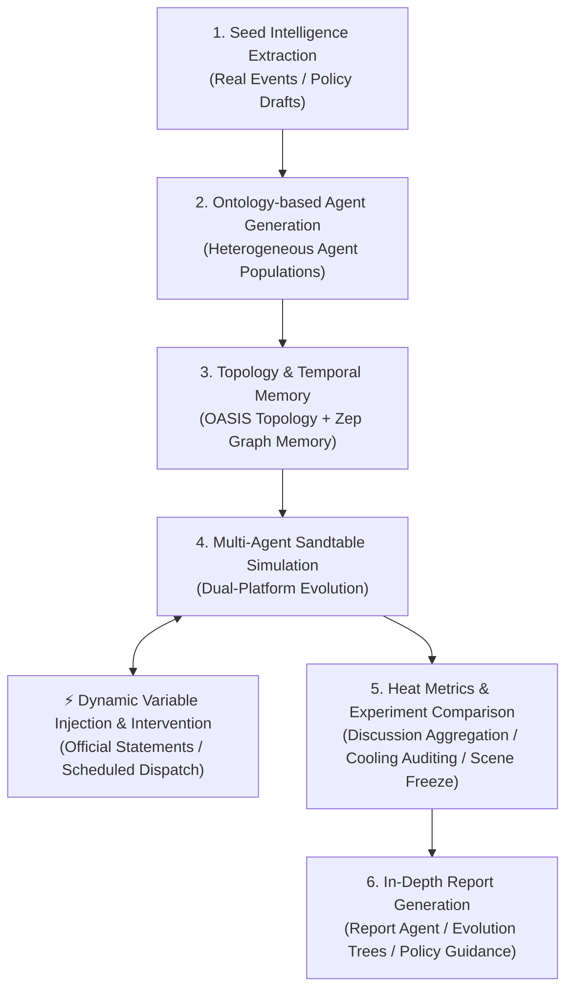

<div align="center">

# 「知 微」 (ZhiWei)
### Swarm Intelligence Public Opinion Evolution Sandtable & Future Deduction Engine

[](https://www.python.org/)
[](https://fastapi.tiangolo.com/)
[](https://vuejs.org/)
[](https://www.docker.com/)
[](./LICENSE)

**[中文文档](./README.md) | [English](./README-EN.md)**

</div>

---

## ⚡ Overview

**ZhiWei (知微)** is a next-generation public opinion evolution sandtable and future deduction engine powered by multi-agent social computing. Tailored for crisis public relations rehearsal in major breaking events and public policy assessment,依托媒体融合与传播国家重点实验室 (State Key Laboratory of Media Convergence and Communication), ZhiWei extracts seed intelligence from real-world events, synthesizes heterogeneous agent populations with diverse cognitive stances, tracks dynamic temporal memories, and injects dynamic variables and intervention strategies during simulations to evaluate opinion polarization shifts and cooling cycles under alternative decisions.

> **Input**: Real-world breaking news, public opinion reports, or policy drafts, along with deduction requirements and intervention variables  
> **Output**: Microscopic swarm evolution sandtable, comparative intervention efficacy analysis, quantified heat and cooling cycle metrics, and actionable decision-support reports

---

## 🛠️ Tech Stack

| Domain | Core Technologies & Components | Description |
|--------|--------------------------------|-------------|
| **Backend Framework** | Python 3.11+, FastAPI | High-concurrency async APIs, cross-process simulation scheduling, and task orchestration |
| **Social Simulation** | OASIS | Social network topologies, agent behavioral mechanics, and multi-platform interactions |
| **Memory & Retrieval** | Zep Graph Memory, GraphRAG | Cross-round dynamic entity knowledge graphs, interaction persistence, and on-demand retrieval |
| **Cognition & Profiles** | Ontological Knowledge Graphs (Ontology) | Trait mapping, cognitive stance profiling, and behavioral preference modeling |
| **Frontend & UI** | Vue 3, Vite, TailwindCSS, D3.js | Reactive simulation monitoring feed, heat metrics trends, and experiment comparison dashboard |
| **Deployment** | Docker, Docker Compose, uv | Ultra-fast dependency resolution and containerized deployment |

---

## 🌟 Key Architectures & Technical Implementations

### 1. Heterogeneous Agent Generation & Micro-Ecosystem Construction
- **Ontology Profile Mapping**: Automatically extracts entity relationships and social roles from seed event materials based on ontological knowledge graphs.
- **Differentiated Agent Personas**: Synthesizes hundreds of heterogeneous agents with distinct cognitive stances, socioeconomic backgrounds, topic sensitivity, and interaction habits.
- **Multi-Platform Network Topology**: Integrates with OASIS to establish social networks supporting posting, commenting, quoting, and liking behaviors.

### 2. Temporal Graph Memory & GraphRAG Cognitive Enhancement
- **Dynamic Entity Graph Persistence**: Integrates Zep Graph Memory to construct dynamic cross-round entity graphs, persisting agent interaction events and opinion evolution topologies.
- **On-Demand Cross-Round Retrieval**: Uses GraphRAG to retrieve historical context across rounds, mitigating context-window forgetting and achieving an **89.6%** entity memory recall rate.

### 3. Dynamic Variable Injection & Intervention Assessment
- **Cross-Process Simulation IPC Coordinator**: Implements inter-process communication and state barrier synchronization, enabling runtime injection of official statements and guidance bulletins.
- **Runtime Statement Interventions**:
  - Supports both immediate publication (`immediate`) and scheduled round dispatch (`scheduled`);
  - Enforces atomic file-locking queues and SHA-256 idempotency to prevent replay;
  - Closes the loop with OASIS post receipt confirmation and fault tolerance.
- **Discussion Heat & Auditable Cooling Metrics**:
  - **Per-Round Heat Aggregation**: Aggregates verified agent interactions per topic without silent null-suppression;
  - **Auditable Cooling Duration**: Determines cooling completion based on continuous threshold confirmation windows, handling peak tie-breaking and rebound tracking;
  - **Manual Label Correction & Audit Trail**: Allows operators to review, override, and revision-control topic labels.
- **Controlled Experiment Comparison Engine**:
  - **Simulation Scene Freeze**: Freezes initial intelligence $T_0$, agent configurations, and metric criteria into immutable SHA-256 verified snapshots;
  - **Physical State Isolation**: Isolates platform databases, run states, and histories across variants with platform-level deterministic RNG seeding;
  - **Controlled Multi-Strategy Evaluation**: Compares Control, Early, and Late intervention runs with explicit causality and limitation disclaimers.

### 4. Deduction Analysis & Report Generation
- **Report Agent Deep Synthesis**: Automatically inspects simulation snapshots post-run to identify opinion flashpoints, polarization tipping points, and secondary risks.
- **Decision-Support Deliverables**: Generates evolution trees, collective sentiment topologies, and policy response plans.

---

## 🔄 System Workflow



---

## 📸 Screenshots

<div align="center">
<table>
<tr>
<td></td>
<td></td>
</tr>
<tr>
<td></td>
<td></td>
</tr>
<tr>
<td></td>
<td></td>
</tr>
</table>
</div>

---

## 🚀 Quick Start

### Option 1: Source Code Deployment (Recommended)

#### Prerequisites

| Tool | Version | Description | Check Installation |
|------|---------|-------------|--------------------|
| **Node.js** | 18+ | Frontend runtime with npm | `node -v` |
| **Python** | ≥3.11, ≤3.12 | Backend runtime | `python --version` |
| **uv** | Latest | High-performance Python package manager | `uv --version` |

#### 1. Configure Environment Variables

```bash
cp .env.example .env
# Edit .env and enter necessary API keys
```

**Required Environment Variables:**

```env
# LLM API configuration (supports any OpenAI SDK-compatible model)
LLM_API_KEY=your_api_key
LLM_BASE_URL=https://dashscope.aliyuncs.com/compatible-mode/v1
LLM_MODEL_NAME=qwen-plus

# Zep Cloud API configuration (optional)
ZEP_API_KEY=your_zep_api_key
```

#### 2. Install Dependencies

```bash
# One-click install all dependencies (root + frontend + backend)
npm run setup:all
```

Or install step-by-step:
```bash
npm run setup          # Frontend dependencies
npm run setup:backend  # Backend dependencies with virtual environment
```

#### 3. Start Development Services

```bash
# Start both frontend and backend concurrently
npm run dev
```

- **Frontend UI**: `http://localhost:3000`
- **Backend API**: `http://localhost:5001`

*(Or start individually: `npm run backend` / `npm run frontend`)*

---

### Option 2: Docker Deployment

```bash
# 1. Prepare environment file
cp .env.example .env

# 2. Build and run containers in background
docker compose up -d
```

Default port mappings: Frontend `3000` / Backend `5001`.

---

## 🧪 Automated Testing

The project maintains comprehensive test coverage:

```bash
# Run backend test suite (intervention runtime, metrics, experiments, adapters)
cd backend && uv run pytest -v

# Run frontend tests
cd frontend && node --test tests/*.test.mjs

# Verify frontend production build
cd frontend && npm run build
```

---

## 📄 Acknowledgments & Attribution

This project, **「知微」 (ZhiWei)**, is developed based on and extended from the open-source project [MiroFish](https://github.com/666ghj/MiroFish) created by [666ghj](https://github.com/666ghj).

Building upon this foundation, ZhiWei is tailored for public relations rehearsals in breaking events and policy evaluations, introducing major innovations:
- **Cross-Process Simulation IPC State Machine Coordinator** & **Runtime Statement Intervention System** (immediate and scheduled announcements/bulletins)
- **Discussion Heat Aggregation** & **Auditable Cooling Duration Calculation Engine**
- **Simulation Scene Freeze** & **Controlled Experiment Comparison Engine** (Control, Early, and Late variant comparisons with uncertainty limitation declarations)
- **Ontological Knowledge Graph (Ontology) Profile Mapping** & **Report Agent** multi-dimensional situation evolution analysis

We express our gratitude to the original authors and the CAMEL-AI [OASIS](https://github.com/camel-ai/oasis) community for their inspiring work and open-source contributions!
