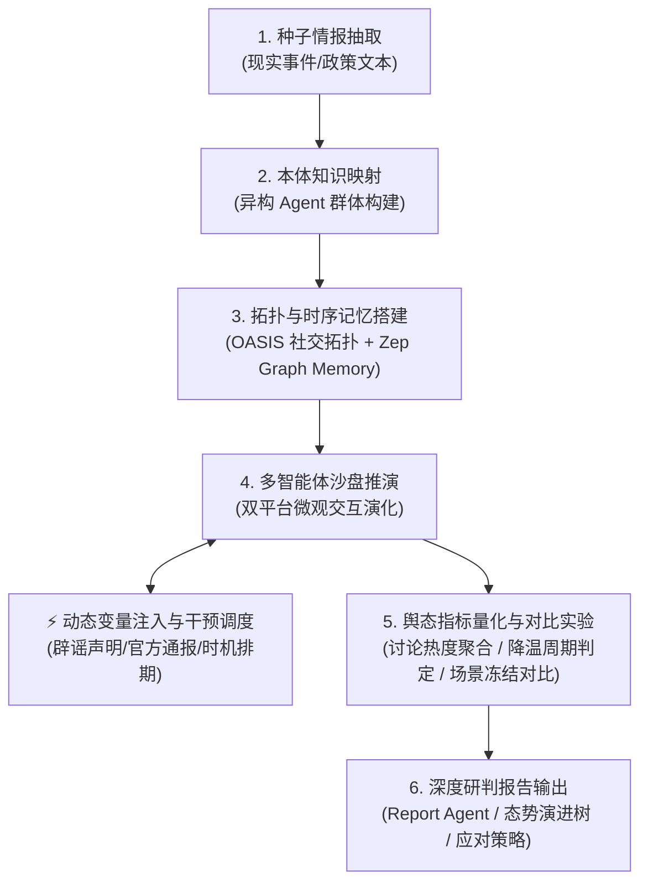

<div align="center">

# 「知 微」 (ZhiWei)
### 群体智能舆论演化沙盘与未来推演引擎
*Swarm Intelligence Public Opinion Evolution Sandtable & Future Deduction Engine*

[](https://www.python.org/)
[](https://fastapi.tiangolo.com/)
[](https://vuejs.org/)
[](https://www.docker.com/)
[](./LICENSE)

**[中文文档](./README.md) | [English](./README-EN.md)**

</div>

---

## ⚡ 项目概述

**「知 微」 (ZhiWei)** 是一款基于多智能体社会计算的新一代舆论演化沙盘与未来推演引擎。面向重大突发事件公关演练与公共政策评估场景，依托媒体融合与传播国家重点实验室，系统支持从现实事件抽取种子情报、生成具备差异化认知的异构 Agent 群体、记录动态时序图谱记忆，并在推演过程中注入动态变量与干预策略，系统化评估不同方案下的舆情极化趋势与平复周期。

> **输入**：现实突发事件材料、舆情分析报告或公共政策草案，设定推演目标与干预变量  
> **输出**：微观群体交互演化沙盘、官方声明干预效果对比、讨论热度与降温周期量化指标、决策建议与态势演化分析报告

---

## 🛠️ 技术栈

| 领域 | 核心技术与组件 | 说明 |
|------|---------------|------|
| **后端框架** | Python 3.11+, FastAPI | 高并发异步接口、跨进程仿真调度与任务编排 |
| **社会模拟引擎** | OASIS | 社交网络拓扑搭建、Agent 行为机制与多平台交互 |
| **记忆与知识检索** | Zep Graph Memory, GraphRAG | 跨回合动态实体图谱构建、时序交互持久化与按需高精度检索 |
| **认知与本体映射** | 本体知识图谱 (Ontology) | 人物画像特征映射、认知立场与行为偏好建模 |
| **前端界面** | Vue 3, Vite, TailwindCSS, D3.js | 响应式仿真监控流、指标热度演变折线图与对比实验看板 |
| **容器化与部署** | Docker, Docker Compose, uv | 极速依赖管理与容器化一键部署 |

---

## 🌟 核心架构与技术实现

### 1. 异构 Agent 生成与微观生态构建
- **本体知识图谱映射**：基于本体知识图谱（Ontology）的人物特征映射机制，从真实种子事件中自动抽取实体关系与社会角色。
- **差异化人设建模**：生成数百个具备不同认知立场、阶层属性、敏感度与互动偏好的异构 Agent。
- **多平台社交网络拓扑**：结合 OASIS 搭建高保真社交网络传播拓扑，支持发帖、转评、引用与点赞等群体交互行为。

### 2. 时序图谱记忆与 GraphRAG 认知增强
- **动态实体图谱持久化**：集成 Zep Graph Memory，构建跨回合动态实体图谱，完整沉淀 Agent 间的互动事件与观点演进拓扑。
- **跨轮次按需检索**：借助 GraphRAG 在推演各轮次按需检索历史记忆，有效克服传统 LLM 上下文遗忘问题，**实体记忆召回准确率达 89.6%**。

### 3. 动态变量注入与干预评估系统
- **跨进程 IPC 状态机调度器**：研发仿真进程间通信与状态同步机制，支持在推演进行时动态注入官方通报、辟谣声明等干预变量。
- **运行时声明干预（Runtime Interventions）**：
  - 支持即时发布（`immediate`）与指定轮次排期（`scheduled`）官方声明；
  - 基于文件锁与 SHA-256 校验和实现原子排队与防重放幂等保障；
  - 接入 OASIS 发帖闭环回执确认与超时容错。
- **舆论热度与平复降温指标（Intervention Metrics）**：
  - **逐轮讨论热度聚合**：按话题关联度统计各轮次有效互动规模，真实反映舆情走势；
  - **可审计降温判定**：按连续达标窗口严格判定平复降温周期，支持峰值平局早优先与反弹（Rebound）追踪；
  - **人工校准与版本管理**：支持对话题标签进行人工修正与版本追溯。
- **可控对比实验引擎（Intervention Experiments）**：
  - **场景冻结机制**：冻结初始情报 $T_0$、画像分布与指标参数为不可变快照，基于 SHA-256 进行防篡改校验；
  - **环境状态物理隔离**：变体间运行环境、平台数据库与讨论历史严格隔离，结合伪随机种子（RNG）保证确定性对比；
  - **多策略对比分析**：系统对比对照组（Control）、早回应（Early）与晚回应（Late）方案，自动生成科学局限性与因果不确定性说明。

### 4. 推演结果分析与报告输出
- **Report Agent 深度分析**：仿真结束后，Report Agent 自动分析沙盘快照中的舆论引爆点、极化拐点与次生风险。
- **决策辅助成果生成**：输出态势演进树、群体情绪演化图谱与危机公关应对建议，为决策者提供科学量化的沙盘评估依据。

---

## 🔄 系统工作流程



---

## 📸 系统界面展示

<div align="center">
<table>
<tr>
<td></td>
<td></td>
</tr>
<tr>
<td></td>
<td></td>
</tr>
<tr>
<td></td>
<td></td>
</tr>
</table>
</div>

---

## 🚀 快速开始

### 方式一：源码部署（推荐）

#### 环境要求

| 工具 | 版本要求 | 说明 | 安装检查 |
|------|---------|------|---------|
| **Node.js** | 18+ | 前端运行环境，包含 npm | `node -v` |
| **Python** | ≥3.11, ≤3.12 | 后端运行环境 | `python --version` |
| **uv** | 最新版 | Python 高效包管理器 | `uv --version` |

#### 1. 配置环境变量

```bash
# 复制示例配置文件
cp .env.example .env

# 编辑 .env 文件，填入必要的 API 密钥
```

**必需环境变量：**

```env
# LLM API 配置（兼容 OpenAI SDK 格式的任意大模型接口）
# 推荐使用阿里百炼平台 qwen-plus 模型
LLM_API_KEY=your_api_key
LLM_BASE_URL=https://dashscope.aliyuncs.com/compatible-mode/v1
LLM_MODEL_NAME=qwen-plus

# Zep Cloud 记忆服务配置（按需使用）
ZEP_API_KEY=your_zep_api_key
```

#### 2. 安装项目依赖

```bash
# 一键安装所有依赖（根目录 + 前端 + 后端）
npm run setup:all
```

或分步安装：
```bash
npm run setup          # 安装前端依赖
npm run setup:backend  # 安装后端依赖并创建虚拟环境
```

#### 3. 启动开发服务

```bash
# 根目录下同时启动前后端服务
npm run dev
```

- **前端界面**：`http://localhost:3000`
- **后端 API**：`http://localhost:5001`

*(也可单独启动：`npm run backend` 仅启动后端，`npm run frontend` 仅启动前端)*

---

### 方式二：Docker 容器化部署

```bash
# 1. 准备环境变量
cp .env.example .env

# 2. 容器构建并后台运行
docker compose up -d
```

默认端口映射为：前端 `3000` / 后端 `5001`。

---

## 🧪 自动化测试

项目具备完善的自动化测试保障体系：

```bash
# 运行后端全量测试套件（包含干预调度、热度指标、对比实验与适配器测试）
cd backend && uv run pytest -v

# 运行前端测试
cd frontend && node --test tests/*.test.mjs

# 检查前端生产构建
cd frontend && npm run build
```

---

## 📄 致谢与开源声明 (Acknowledgements & Attribution)

本项目 **「知微」 (ZhiWei)** 基于开源项目 [MiroFish](https://github.com/666ghj/MiroFish)（由原作者 [666ghj](https://github.com/666ghj) 发起）进行深度二次研发与架构扩展。

在此基础上，本项目针对重大突发事件演练与公共政策评估场景，研发并扩展了：
- **跨进程仿真 IPC 状态机调度器** 与 **运行时声明干预系统**（即时/排期辟谣与引导通报）
- **舆论讨论热度聚合** 与 **达标降温窗口可审计计算引擎**
- **场景冻结机制** 与 **受控对比实验系统**（Control / Early / Late 变体对比与局限性声明）
- **本体知识图谱（Ontology）人物特征映射** 与 **Report Agent** 态势演化分析

衷心感谢原作者团队与 CAMEL-AI [OASIS](https://github.com/camel-ai/oasis) 社区的卓越工作与开源贡献！
